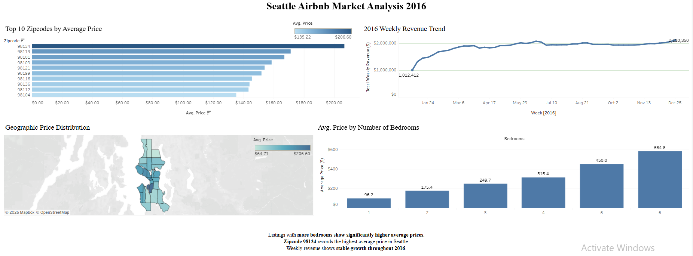

# 🏠 Seattle Airbnb Market Analysis 2016

**Interactive Tableau Dashboard** | Data Visualization | Business Intelligence

### 📌 Project Overview
In-depth market analysis of **Airbnb listings in Seattle during 2016** using Tableau. This interactive dashboard uncovers pricing patterns, geographic distribution, weekly revenue trends, and the relationship between the number of bedrooms and listing prices.

This project demonstrates my ability to:
- Handle large datasets
- Create clear, actionable visualizations
- Deliver business insights for stakeholders

---

### 🎯 Live Interactive Dashboard
**🔗 [View Full Interactive Dashboard on Tableau Public](https://public.tableau.com/app/profile/muhammad.thoriq4465/viz/SeattleAirbnb2016MarketInsights/Dashboard1)**

*(Click the image below to open the fully interactive version)*

---

### 🔍 Key Business Insights
- **Zipcode 98134** recorded the **highest average price** in Seattle at **$206.60**
- More bedrooms = significantly higher average price (from $96.20 for 1 bedroom to **$584.80** for 6 bedrooms)
- **Weekly revenue** showed **stable growth** throughout 2016, peaking at **$2.41 million** per week
- Highest-priced areas are concentrated in central Seattle (see geographic price distribution map)

---

### 📊 Dashboard Features
- **Top 10 Zipcodes by Average Price** – Interactive bar chart
- **Geographic Price Distribution** – Color-coded Seattle map
- **Average Price by Number of Bedrooms** – Clear breakdown by listing type
- **2016 Weekly Revenue Trend** – Line chart showing overall revenue growth

All visualizations are **fully interactive** (filters, hover tooltips, and drill-down).

---

### 📥 Download Files

**📂 Tableau Workbook (.twbx)**
- [Download Workbook – Seattle Airbnb Market Analysis](workbooks/Seattle_Airbnb_Analysis.twbx)

**📊 Raw Dataset (Excel – >25 MB)**
- [📥 Download Full Dataset on Google Drive](https://docs.google.com/spreadsheets/d/1pvP7zjgxRsROOpVzO_EppQpEYVEpLRRi/edit?usp=sharing&ouid=113320475110676543316&rtpof=true&sd=true) *(Anyone with the link)*

**📸 Full Dashboard Screenshots**
View all screenshots in the [`screenshots/`](screenshots/) folder.

---

### 🛠️ Tools & Technologies
- **Tableau Desktop & Tableau Public** (Advanced)
- **Microsoft Excel** (Data Cleaning & Preparation)
- Data Visualization & Storytelling
- Market Analysis & Business Intelligence

---

### 🎓 Skills Demonstrated
- Data cleaning and preparation from raw datasets
- Advanced dashboard design following Tableau best practices
- Insight-driven storytelling for business decision-making
- Real estate pricing analysis and revenue trend forecasting

---

### 🚀 How to Explore This Project
1. Open the **Tableau Public link** above
2. Download the `.twbx` file to explore in Tableau Desktop
3. Download the full Excel dataset from Google Drive
4. Check the screenshots folder for high-resolution images

---

**Made with ❤️ by [Your Full Name]**  
Aspiring Data Analyst | Tableau Specialist | Business Intelligence Enthusiast

---

*Last updated: March 2026*
